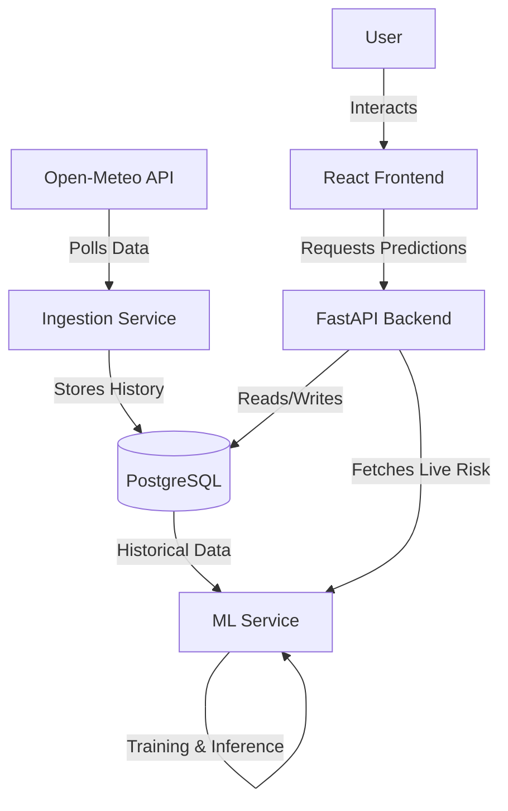

# Grid Outage Prediction & Restoration Time Estimator


A full-stack AI-powered utility dashboard that transforms how utility companies respond to extreme weather events. By combining real-time weather data with physics-based machine learning models, this system predicts grid failures *before* they happen and optimizes crew dispatch.

---

## 📸 Screenshots

| **Live Risk Map** |
|:---:|:---:|
|  |
| *Real-time visualization of high-risk feeders* |

---

## 🏗️ Architecture

The system follows a modern microservices architecture containerized with Docker.



---

## 🧠 The Brain: Predictive ML Engine

At the core is a **Random Forest Classifier** trained on physics-based ground truth data.

1.  **Data Generation**: Synthetic training data simulates failure physics (Wind Load, Thermal Derating, Asset Aging).
2.  **Training**: The model learns non-linear interactions (e.g., `Old Asset + High Wind = Critical Risk`).
3.  **Real-Time Inference**:
    *   Polls live weather for the service area.
    *   Feeds data into the model to generate a live **Outage Probability (0-100%)**.

---

## � Key Features

*   **� Interactive Risk Map**: Visualizes 200+ distribution feeders, color-coded by real-time risk severity.
*   **🌪️ Live Weather Integration**: Reacts instantly to changing weather conditions in the Bay Area via Open-Meteo.
*   **🧪 Simulation Mode**: Inject "What-If" scenarios (e.g., "Simulate a Category 3 Hurricane") to test grid resilience.
*   **⏱️ Automated ETR**: Instantly calculates Estimated Time of Restoration based on failure severity.
*   **📈 Historical Tracking**: Records predictions for long-term trend analysis.

---

## 🛠️ Tech Stack

### Frontend
*   **React + Vite**: Blazing fast UI development.
*   **Leaflet**: Interactive mapping for grid visualization.
*   **TailwindCSS**: Modern, responsive styling.
*   **Chart.js**: Data visualization for risk trends.

### Backend
*   **FastAPI**: High-performance, async Python API.
*   **Scikit-learn**: Random Forest implementation for prediction.
*   **Pandas/NumPy**: Data manipulation and processing.

### Infrastructure
*   **Docker Compose**: Orchestrates API, Database, and Background Workers.
*   **PostgreSQL**: Robust, relational storage for time-series data.

---

## Start

### Option A: Cloud Mode (Recommended)
Run the full stack (Frontend, Backend, DB, Workers) with one command:

```bash
docker-compose up --build
```
*Access the dashboard at* `http://localhost:5173`

### Option B: Local Development

#### 1. Start the Backend
```bash
cd backend
pip install -r requirements.txt
python -m uvicorn app.main:app --reload --host 0.0.0.0 --port 8081
```

#### 2. Start the Frontend
```bash
cd frontend
npm install
npm run dev or cmd /c "npm run dev
```

---

## 📂 Project Structure

```text
PCD Grid project/
├── backend/                # FastAPI Application
│   ├── app/
│   │   ├── api/            # API Routes
│   │   ├── services/       # ML & Weather Logic
│   │   └── models/         # Pydantic & DB Models
│   ├── Dockerfile
│   └── requirements.txt
├── frontend/               # React Application
│   ├── src/
│   │   ├── components/     # UI Components (Map, Widgets)
│   │   └── services/       # API Client
│   └── Dockerfile
├── docker-compose.yml      # Orchestration
└── README.md               # You are here
```

---

